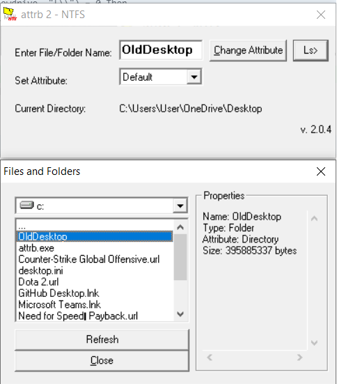

# What is ATTRB
Attrb is an application to manipulate windows folder attribute. This is very helpful on changing attributes.
Created to fix folder attributes unintentional changes

# Snapshot

# Features
Attrb features the following functionalities
- Read Folder Info
- Update attributes

# System Requirements
- Windows XP and above
- Not tested in Linux Wine System

# Future
- Additional features will be added soon
